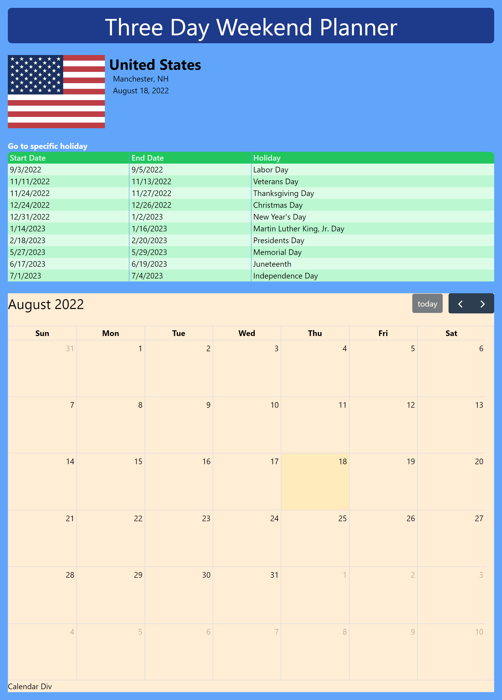

# project-placeholder
This application helps the user identify and plan upcoming extended weekends.

* When the page loads, the user's location information is displayed
* When the page loads, the holidays recognized in the user's location populate a table with the extended weekend start and end dates
* An interactive calendar holds a visual representation of the holidays listed in the table
* The interactive calendar allows the user to enter and store information in specific dates

## Where to Find It
The application is deployed [here](https://pikaypi.github.io/project-placeholder/ target="_blank").

## What It Looks Like

## How It Works
Upon loading, the application uses the user's IP address and the IP WHOIS API to determine the user's location. Then the geographical location information is used with the Nager.Date API to determine when the extended weekends will occur in the user's area over the next year. A table of long weekends and their associated holidays automatically populates once this information is retrieved.
